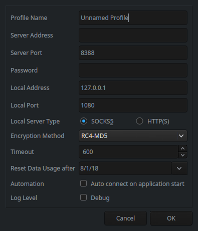

# linux版本
deepin 15.6 
Linux version 4.15.0-21deepin-generic (pbuilder@gs-PC) (gcc version 7.2.0 (Debian 7.2.0-20)) #21 SMP Mon May 21 05:20:09 UTC 2018

# 安装ShadowsocksQt5
使用deepin-store直接搜索安装或使用命令安装

``` bash
$ sudo apt-get install shadowsocks-qt5
```

安装后配置代理服务器



# 安装chrome SwitchyOmega插件
## github安装https://github.com/FelisCatus/SwitchyOmega/releases 下载cxr后缀文件
## chrome中输入chrome://extensions/ 托入下载的文件，完成安装
## 配置代理127.0.0.1 port 1080  "Apply changes"保存配置
## 使用"auto switch"或"proxy"使用代理
