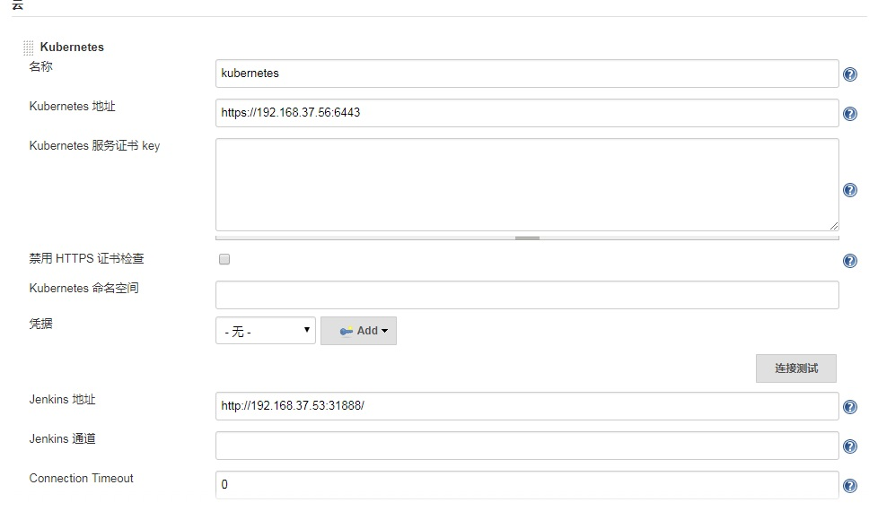
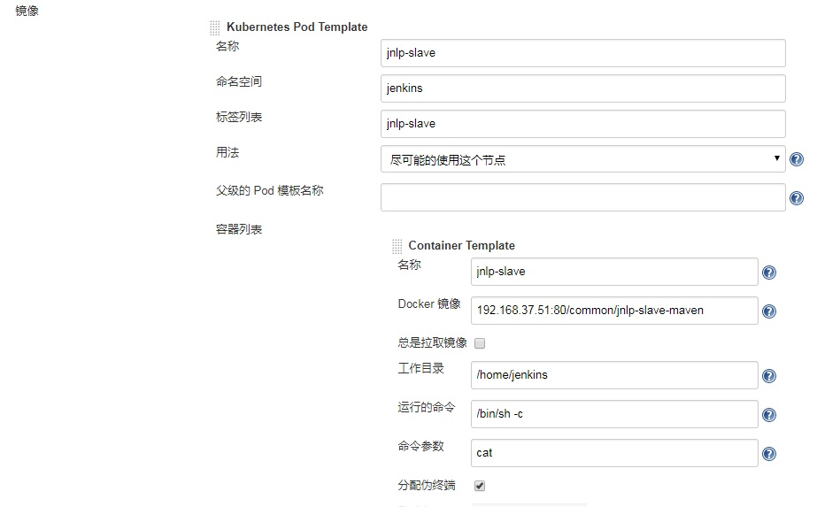
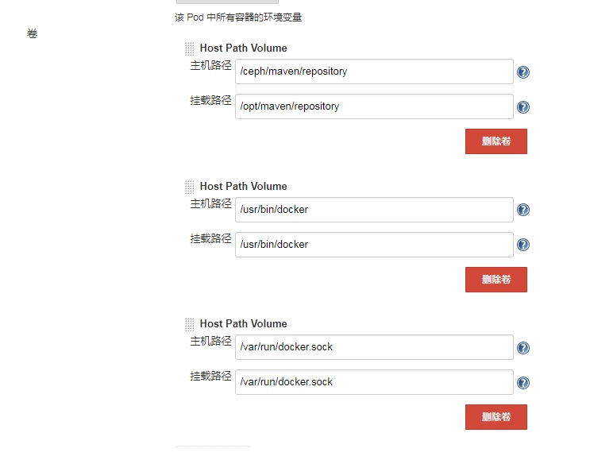
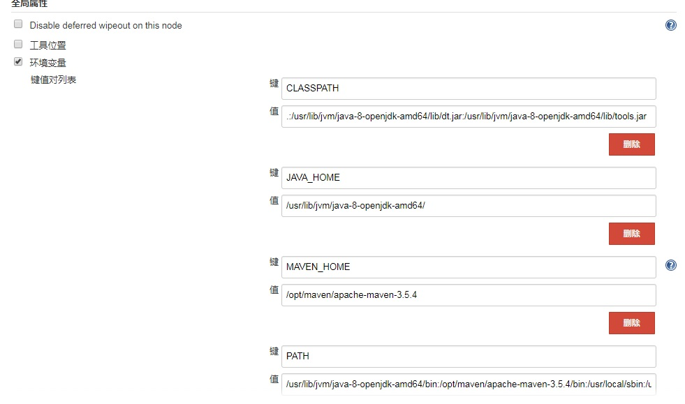
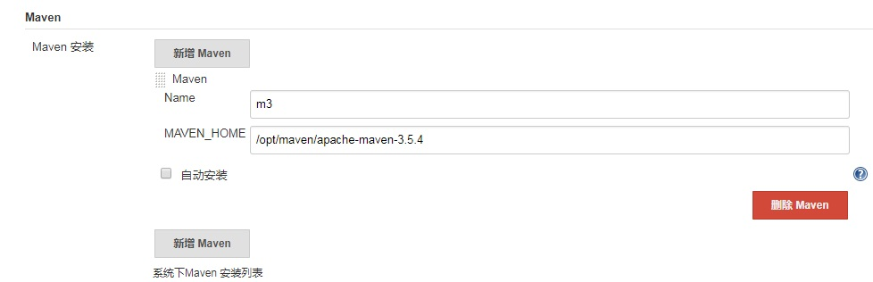
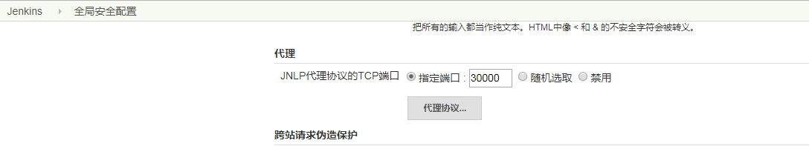

# jenkins动态slave配置
## 1、镜像准备
### 1.1jenkins master Dockerfile
```
FROM jenkins/jenkins:latest
ENV MAVEN_VERSION 3.5.4
ENV MAVEN_HOME /opt/maven/apache-maven-${MAVEN_VERSION}
# build java
COPY ./libltdl.so.7 /usr/lib/libltdl.so.7
# build maven
COPY apache-maven-${MAVEN_VERSION}-bin.tar.gz /tmp/maven/apache-maven-${MAVEN_VERSION}-bin.tar.gz
COPY settings.xml /tmp/maven/settings.xml
USER root:root
RUN mkdir -p /opt/maven/repository \
&& cd /opt/maven \
&& tar -zxvf /tmp/maven/apache-maven-${MAVEN_VERSION}-bin.tar.gz \
&& cp /tmp/maven/settings.xml ${MAVEN_HOME}/conf/settings.xml \
&& rm -rf /tmp/maven
ENV PATH ${JAVA_HOME}/bin:${MAVEN_HOME}/bin:${PATH}
```


### 1.2 jenkins slave Dockerfile
```
FROM jenkinsci/jnlp-slave:latest
ENV MAVEN_VERSION 3.5.4
ENV MAVEN_HOME /opt/maven/apache-maven-${MAVEN_VERSION}
#ENV JAVA_HOME /usr/local/java
#ENV CLASSPATH .:$JAVA_HOME/lib/dt.jar:$JAVA_HOME/lib/tools.jar
# build java
#COPY ./usr/local/java ${JAVA_HOME}
COPY ./libltdl.so.7 /usr/lib/libltdl.so.7
# build maven
COPY apache-maven-${MAVEN_VERSION}-bin.tar.gz /tmp/maven/apache-maven-${MAVEN_VERSION}-bin.tar.gz
COPY settings.xml /tmp/maven/settings.xml
USER root:root
RUN mkdir -p /opt/maven/repository \
&& cd /opt/maven \
&& tar -zxvf /tmp/maven/apache-maven-${MAVEN_VERSION}-bin.tar.gz \
&& cp /tmp/maven/settings.xml ${MAVEN_HOME}/conf/settings.xml \
&& rm -rf /tmp/maven \
&& apt-get -yq update \
&& apt-get -yq --no-install-recommends --no-install-suggests install sshpass \
&& apt-get clean -y \
&& mkdir -p /home/jenkins/workspace/
ADD kubernetes-client-linux-amd64.tar.gz .
RUN cp kubernetes/client/bin/kube* /usr/bin/ \
    && chmod a+x /usr/bin/kube* \
    && rm -rf kubernetes
ENV PATH ${MAVEN_HOME}/bin:${PATH}
```
**注：slave需要使用root权限，不然打包镜像的时候会报docker权限异常**

**问题：jenkins上配置salve启动镜像为自定义镜像，但执行打包时需要把自定义镜像和jenkins/jnlp-slave:alpine镜像也拉下来，日志显示启动的是自定义镜像，但容器启动后没有安装maven，所以手动把自定义镜像192.168..7.51:80/common/jnlp-maven-kubectl改名为jenkins/jnlp-slave:alpine**

## 2 jenkins容器部署
jenkins-account.yaml
```
apiVersion: v1
kind: ServiceAccount
metadata:
  labels:
    k8s-app: jenkins
  name: jenkins-admin
  namespace: default
 
---
kind: ClusterRoleBinding
apiVersion: rbac.authorization.k8s.io/v1beta1
metadata:
  name: jenkins-admin
  labels:
    k8s-app: jenkins
subjects:
  - kind: ServiceAccount
    name: jenkins-admin
    namespace: default
roleRef:
  kind: ClusterRole
  name: cluster-admin
  apiGroup: rbac.authorization.k8s.io
---
jenkins-deployment.yaml
apiVersion: apps/v1beta2
kind: Deployment
metadata:
  name: jenkins
  namespace: default
  labels:
    k8s-app: jenkins
spec:
  replicas: 1
  selector:
    matchLabels:
      k8s-app: jenkins
  template:
    metadata:
      labels:
        k8s-app: jenkins
    spec:
      containers:
      - name: jenkins
        image: 192.168.37.51:80/common/jenkins-maven3:latest
        imagePullPolicy: IfNotPresent
        volumeMounts:
        - name: jenkins-home
          mountPath: /var/jenkins_home
        - name: maven-repository
          mountPath: /opt/maven/repository
        - name: docker
          mountPath: /usr/bin/docker
        - name: docker-sock
          mountPath: /var/run/docker.sock
        ports:
        - containerPort: 8080
        - containerPort: 50000
      volumes:
        - name: jenkins-home
          hostPath:
            path: /ceph/jenkins_home
        - name: maven-repository
          hostPath:
            path: /ceph/maven/repository
        - name: docker
          hostPath:
            path: /usr/bin/docker
        - name: docker-sock
          hostPath:
            path: /var/run/docker.sock
      serviceAccountName: jenkins-admin
---
jenkins-service.yaml
kind: Service
apiVersion: v1
metadata:
  labels:
    k8s-app: jenkins
  name: jenkins
  namespace: default
  annotations:
    prometheus.io/scrape: 'true'
spec:
  ports:
    - name: jenkins
      port: 8080
      nodePort: 31888
      targetPort: 8080
    - name: jenkins-agent
      port: 30000
      nodePort: 30000
      targetPort: 30000
  type: NodePort
  selector:
    k8s-app: jenkins
```
### 2.1 启动jenkins
```
kubectl apply -f jenkins-account.yaml

kubectl apply -f jenkins-deployment.yaml

kubectl apply -f jenkins-service.yaml
```


## 3 初始化jenkins
### 3.1 需要安装的插件
Kubernetes Cli Plugin：该插件可直接在Jenkins中使用kubernetes命令行进行操作。

Kubernetes plugin： 使用kubernetes则需要安装该插件

Kubernetes Continuous Deploy Plugin：kubernetes部署插件，可根据需要使用

Pipeline Utility Steps：pipeline脚本中读取配置文件使用

**注：安装pipeline可视化工具blueOcean后不能正常启动slave执行pipeline(可能是安装插件后jnlp端口重置有关)**


### 3.2 配置云
kubernetes地址：https://192.168.37.56:6443

jenkins地址：http://192.168.37.53:31888



#### 配置slave pod模板

名称：jnlp-slave（自定义）

命名空间：jenkins（需要在k8s中创建）

标签列表：jnlp-slave（后续启动pipeline需要填写的node名称）

添加容器：

名称：jnlp-slave

镜像：192.168.37.51:80/common/jnlp-slave-maven（安装了jdk、maven的jnlp镜像，需要在启动slave的机器上使用docker pull手动拉取，另外启动slave使用的镜像实际是jenkins/jnlp-slave:alpine，所以需要把自定义镜像tag成jenkins/jnlp-slave:alpine）




#### 配置slave pod挂载的卷

挂载指定的目录到宿主机，避免重启造成的配置丢失

**maven：**

主机路径：/ceph/maven/repository

容器路径：/opt/maven/repository

**docker：**

主机路径：/usr/bin/docker

容器路径：/usr/bin/docker

**docker.sock:**

主机路径：/var/run/docker.sock

容器路径：/var/run/docker.sock

**通用配置文件**

主机路径：/ceph/lppa_params

容器路径：/home/jenkins/lppa_params

**k8s配置**

主机路径：/root/.kube

容器路径：/root/.kube




### 3.3 配置全局属性
#### CLASSPATH:

.:/usr/lib/jvm/java-8-openjdk-amd64/lib/dt.jar:/usr/lib/jvm/java-8-openjdk-amd64/lib/tools.jar

**JAVA_HOME:**

/usr/lib/jvm/java-8-openjdk-amd64

**MAVEN_HOME:**

/opt/maven/apache-maven-3.5.4

**PATH:**

/usr/lib/jvm/java-8-openjdk-amd64/bin:/opt/maven/apache-maven-3.5.4/bin:/usr/local/bin:/usr/local/sbin:/usr/bin:/usr/sbin:/bin:/sbin




### 3.4 全局工具配置
name:m3

MAVEN_HOME:/opt/maven/apache-maven-3.5.4



### 3.5 jnlp代理配置
默认指定端口50000，由于环境限制配置30000。注：每次重启jenkins端口会重置为50000，如果不修改为30000将会启动slave失败



## 4 新建一个pipeline任务 demo
pipeline script

```
node('jnlp-slave') {
    stage('Clone') {
        echo "1.Clone Stage"
        checkout([$class: 'SubversionSCM', additionalCredentials: [], excludedCommitMessages: '', excludedRegions: '', excludedRevprop: '', excludedUsers: '', filterChangelog: false, ignoreDirPropChanges: false, includedRegions: '', locations: [[cancelProcessOnExternalsFail: true, credentialsId: 'actSvn', depthOption: 'infinity', ignoreExternalsOption: true, local: '.', remote: 'svn://192.168.37.243/lppz/cat-trace-test']], quietOperation: true, workspaceUpdater: [$class: 'UpdateUpdater']])
        script{
            def tagprop = readProperties file: 'micro-server-source/tag.properties'
            docker_tag = tagprop.tagversion
            rest_port = tagprop.rest_port
            project_name= tagprop.project_name
            project_line= tagprop.project_line
        }
    }
    stage('Test') {
      echo "2.Test Stage"
      echo "${docker_tag}"
      echo "${rest_port}"
      echo "${project_name}"
      echo "${project_line}"
    }
    stage("Install"){
        echo "3.Maven install Stage"
        sh "mvn clean install -pl ${project_name} -am -Dmaven.test.skip=true"
    }
    stage('Build') {
        echo "4.Build Docker Image Stage"
        sh "cp /home/jenkins/lppz_props/* ${project_name}"
        sh "sed -i 's/<docker_tag>/${docker_tag}/' ${project_name}/k8s.yaml"
        sh "sed -i 's/<project_name>/${project_name}/' ${project_name}/k8s.yaml"
        sh "sed -i 's/<rest_port>/${rest_port}/' ${project_name}/k8s.yaml"
        sh "sed -i 's/<project_line>/${project_line}/' ${project_name}/k8s.yaml"
        sh "sed -i 's/<project_name>/${project_name}/' ${project_name}/Dockerfile"
        sh "cat ${project_name}/Dockerfile"
        sh "cat ${project_name}/k8s.yaml"
        sh "cd ${project_name} && docker build -t 192.168.37.51:80/testoms/${project_name}:${docker_tag} ."
    }
    stage('Push') {
        echo "5.Push Docker Image Stage"
        withCredentials([usernamePassword(credentialsId: 'dockerHub', passwordVariable: 'dockerHubPassword', usernameVariable: 'dockerHubUser')]) {
          sh "docker login -u ${dockerHubUser} -p ${dockerHubPassword} 192.168.37.51:80"
          sh "docker push 192.168.37.51:80/${project_line}/${project_name}:${docker_tag}"
        }
    }
    stage('Deploy') {
        echo "6. Deploy Stage"
        sh "kubectl apply -f ${project_name}/k8s.yaml"
        echo "This is a deploy step to "
    }
}
```
**注：**

1、svn配置“PipelineSyntax”中的“checkout:Check out from version control”配置并生产

2、push阶段login的userName和userPassword是通过在首页凭证菜单中添加，注意ID与credentialsId一致，

passwordVariable和usernameVariable就是在ID的后面加上User和Password


最后执行构建
